<div align="center">



</div>

<br/>

<div align="center">

[](https://www.linkedin.com/in/agene-sunday-4b35702aa)
[](https://x.com/Asobuilds)
[](https://github.com/Asobuilds)

</div>

<br/>


<br/>

## `> whoami`

```go
package main

type Engineer struct {
    Name         string
    Role         string
    Location     string
    Languages    []string
    Focus        string
    Philosophy   string
}

func main() {
    me := Engineer{
        Name:      "Agene Sunday Okoh",
        Role:      "Software Programmer · AI Native · Solution Builder",
        Location:  "Abuja, Nigeria 🇳🇬",
        Languages: []string{"Go", "Rust", "Python", "JavaScript", "HTML", "CSS"},
        Focus:     "AI/ML Engineering · Autonomous Systems · Open Source",
        Philosophy: "Build systems that create leverage. Ship things that matter.",
    }

    me.Build()
}
```

<br/>


<br/>

## `> cat current_focus.md`

<table>
<tr>
<td width="50%" valign="top">

### 🔬 What I'm Building

- **AI/ML systems** — autonomous agents, inference pipelines, intelligent tooling
- **Go backends** — performant, concurrent, production-grade services
- **9ja Exam Hub** — AI-powered exam preparation platform for Nigerian students
- Exploring **Rust** for systems-level performance engineering

</td>
<td width="50%" valign="top">

### 📡 What I'm Learning

- Large Language Model architecture and fine-tuning
- Retrieval-Augmented Generation (RAG) patterns
- Distributed systems design in Go
- WebAssembly with Rust
- AI agent orchestration frameworks

</td>
</tr>
</table>

<br/>


<br/>

## `> ls -la philosophy/`

> *I believe software should create real leverage — one engineer, one system, multiplied impact. I write code that is maintainable before it is clever, observable before it is fast, and useful before it is elegant. I build in the open because the best ideas survive scrutiny.*

<br/>

| Principle | Practice |
|---|---|
| **Simplicity** | If it needs a long explanation, redesign it |
| **Observability** | A system you can't see is a system you can't fix |
| **Composability** | Small, focused modules that combine cleanly |
| **Ownership** | Ship it, monitor it, improve it |
| **Community** | Open source is how we compound knowledge |

<br/>


<br/>

## `> ls projects/featured/`

<br/>

<table>
<tr>
<td width="100%" valign="top">

### 🎓 9ja Exam Hub

> AI-powered exam preparation platform built for Nigerian students and institutions.

**Architecture** — Go backend · REST API · AI inference layer · Web frontend

**Stack** — `Go` `Python` `HTML` `CSS` `JavaScript`

**What it does**
- Serves intelligent, adaptive practice questions
- Tracks student performance over time
- Built specifically for the Nigerian curriculum and exam formats
- Designed to be accessible on low-bandwidth connections

**Engineering Challenge** — Building an AI inference pipeline that performs reliably on constrained infrastructure, serving users across Nigeria where connectivity is inconsistent.

**Status** — `Active Development`

[](https://github.com/Asobuilds)

</td>
</tr>

<tr><td><br/></td></tr>

<tr>
<td width="100%" valign="top">

### 🖥️ L2E CodeStudy Platform

> Community learning platform built for the Learn2Earn Nigeria Fellowship, serving student developers across campuses.

**Architecture** — Go web server · Static asset serving · Piston API integration · REST

**Stack** — `Go` `HTML` `CSS` `JavaScript`

**What it does**
- Four progressive learning stages with randomized questions
- Real Go code execution via Piston API (live, in-browser)
- Hint systems, progress tracking, confetti rewards
- Dark-mode dashboard with persistent theme preference

**Engineering Challenge** — Designing a real code-execution sandbox that is safe, fast, and accessible to student developers with no backend experience.

**Lesson Learned** — Product thinking matters as much as engineering. The confetti and progress bars weren't decoration — they drove completion rates up significantly.

[](https://github.com/Aso07/l2e-codestudy-platform)

</td>
</tr>

<tr><td><br/></td></tr>

<tr>
<td width="100%" valign="top">

### 🎨 ASCII Art Engine

> Full CLI tool for rendering styled ASCII art from text — built from scratch without external art libraries.

**Architecture** — Go module · Internal package structure · Banner file parsing · ANSI terminal output

**Stack** — `Go`

**What it does**
- Renders text into styled ASCII art using bitmap font banner files
- `--output=<file>` flag for writing to disk via `io.Writer`
- `--color=<color>` ANSI highlighting with per-character position control
- `--align=<type>` terminal alignment with ANSI-aware visible width calculation
- Full test suite per function

**Engineering Detail** — The banner lookup formula `(asciiValue - 32) * 9 + 1` encodes the entire character map. Getting row-by-row rendering and ANSI-stripped width calculations right required careful systems thinking.

[](https://github.com/Asobuilds)

</td>
</tr>
</table>

<br/>


<br/>

## `> cat stack.json`

<br/>

**Languages**


<br/>

**AI / ML**


<br/>

**Tools & Environment**


<br/>


<br/>

## `> ./stats --profile`

<br/>

<div align="center">

[](https://github.com/Asobuilds)

[](https://github.com/Asobuilds)

[](https://github.com/Asobuilds)

</div>

<br/>


<br/>

## `> cat open_source.md`

I believe in building in public and giving back to the communities that taught me. Open source is how individual engineers create disproportionate impact.

- **L2E CodeStudy Platform** — open-sourced for any fellowship or cohort to fork and adapt
- **ASCII Art Engine** — fully documented, tested, and modular for reuse
- Actively looking to contribute to Go tooling, AI infrastructure, and African tech projects

> *If you maintain an open-source project in Go, Rust, or AI/ML and are looking for a focused contributor — reach out.*

<br/>


<br/>

## `> cat community.md`

**Learn2Earn Nigeria Fellowship** — Otukpo Campus
Building tools and projects that benefit the fellowship community directly. The L2E CodeStudy Platform was built specifically to improve learning outcomes for fellow students.

Currently growing toward:
- Speaking at African tech communities about Go and AI engineering
- Writing technical content on building AI systems with Go
- Mentoring newer developers entering the fellowship

<br/>


<br/>

## `> contact --open`

<div align="center">

I'm open to conversations about **AI/ML engineering roles**, **Go/Rust contributions**, and **African tech ecosystem** projects.

<br/>

[](mailto:your-email@example.com)
[](https://www.linkedin.com/in/agene-sunday-4b35702aa)
[-0F172A?style=for-the-badge&logo=x&logoColor=94A3B8)](https://x.com/Asobuilds)

<br/>

*Response time: usually within 48 hours.*

</div>

<br/>



<!--
  ASO BUILDS · github.com/Asobuilds
  Software Programmer · AI Native · Solution Builder
  Built with intention. Maintained with discipline.
-->
